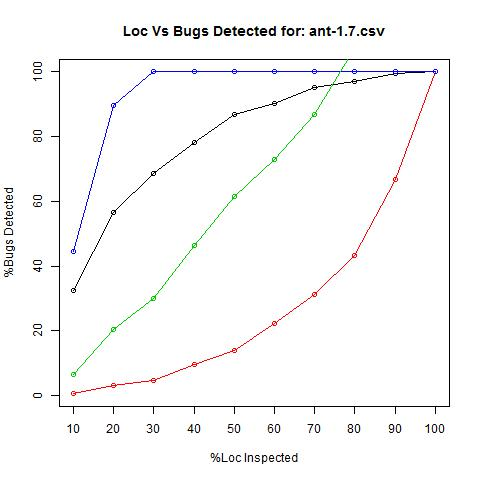

# Data Preprocessing

- Selected Datasets from the ['Open Science Repository'](http://openscience.us/repo)
- As part of data cleaning, removed unnecessary columns from the datasets.
- The Bug column being numeric was converted to binary 0/1 values to perform classification and not regression.
- Bug = 0 corresponds to Class 0
- Bug > 0 corresponds to Class 1 
- To improve the efficiency of trained models, used the SMOTE algorithm to synthetize the datasets to have near equal data points for each class. 

# Training and Testing Datasets

- Training datasets created to build models
- Datasets with ‘n’ versions have the training dataset consisting of ‘n-1’ versions and the nth dataset is used for testing purpose
- The merged dataset of ‘n-1’ versions is SMOTEd to build a more effective classifier.
- Datasets with only ‘1’ version available are SMOTEd to create near equal data objects to represent class 0 and class 1.
- This dataset is divided into 70% and 30% for training and testing purposes respectively.  

# SMOTE Algorithm

**What is SMOTE?**

- Smote is an over sampling approach
- The minority class is oversampled. 
- The procedure is to take each minority class sample and introduce synthetic examples along the line segments joining any/all of the k minority class nearest neighbors.
- The new points are created by performing some operations on the real data’s feature space.
- More details can be found ['here'](http://www.cs.cmu.edu/afs/cs/project/jair/pub/volume16/chawla02a-html/node6.html)

# SMOTE Algorithm

**Why SMOTE the data?**

- To build a training model that is more efficient.
- To be able to help the classifier build larger and less specific decision regions. 
- The model learns about the minority class samples as well as the majority class samples and hence is more generic.
- Decision trees generalize better.
- The synthetic sampling approach tends to be better than over-sampling with replacement.

# Testing

- After training, we saved the bestmodel.
- We used the bestmodel (with the best recall vaule) to test the testdata we have seperated before (in test directory).
- We wrote a batch file to load the bestmodel we have saved to test the data, making it quicker and easier.
 

# Result Analyzing

- In data mining, area under the curve (AUC) of PD (proportion of bug detected) and LOC (Line of Code) is an important measurement. The larger the AUC, the better the model. 
- According to Arisholm and Briand, if a data miner works, PD must be greater than LOC, which is mimnial curve (y=x).
- As shown from the plot we got, our result (green curve) lied between Manual-Down (black curve) and mimnial.
- So, our model works (better than the mimnial).

# G-measure

- The function we used was $\frac{2*p*d(100-pf)}{pd+(100-pf)}$ 
- pd (proportion of dectected bug) = Recall
- pf (probability of false alarm)  = FP/(FP+TN)

# Example Graph Plot - %LOC Inspected Vs %Bugs Found

# Plotting the results

- The %Bug Found Vs %LOC Inspected is plotted for each of the datasets from the repo.
- The predicted class results based on Training and Testing models is plotted as well.
- The Blue curve represents the God curve
- The Red curve shows the  Manual-Up curve
- The Black curve represnts the Manual-Down curve
- Green curve: Prediction curve based on classifier
